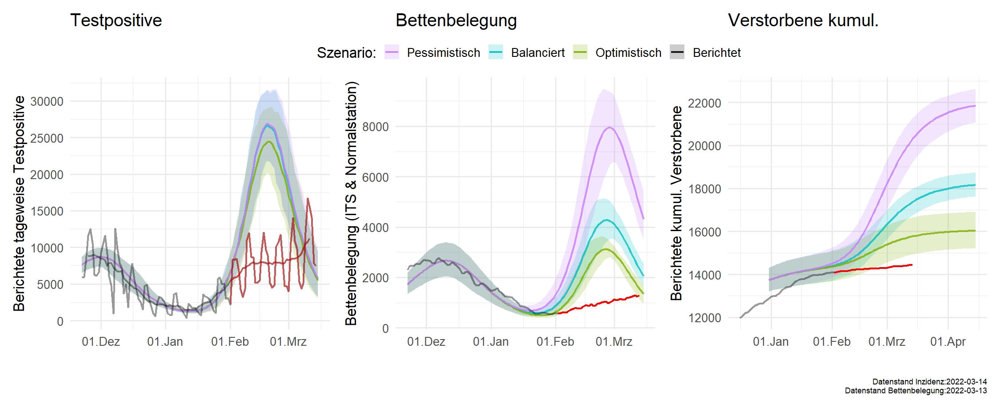

# IMISE-Epidemiologisches-Bulletin-21

Additional Details for the epidemiological bulletin regarding the development of COVID-19 in Saxony and Germany. Details on the Simulation can be found [here](upload/MOCOS_data_for_Bulletin__Jan_31_2022.pdf), additional graphs can be found [here](https://github.com/GenStatLeipzig/IMISE-Epidemiologisches-Bulletin-21/tree/main/upload/additionalPlots)\\

### Comparison observed  data with described scenarios 

Black line shows data used for modelling included in the bulleting, red indicates data observed later.

